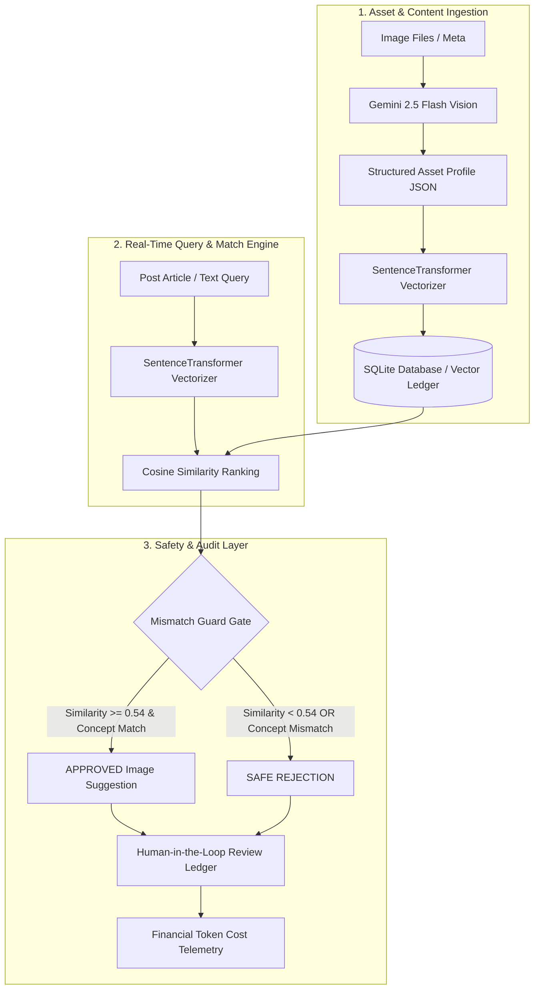

# 🦊 AI Image Understanding & Content Matching Engine

[](https://www.python.org/)
[](https://fastapi.tiangolo.com/)
[](https://www.docker.com/)
[](http://localhost:8000/docs)
[](LICENSE)

An enterprise-grade, deterministic backend decision engine that ingests visual asset libraries and pairs them with textual content — powered by dense vector embeddings, multi-modal vision models, and a strict **Mismatch Guard** validation layer engineered to prioritize safe rejection over inaccurate asset matching.

---

## 📑 Table of Contents
- [Architecture & System Flow](#-architecture--system-flow)
- [Key Technical Features](#-key-technical-features)
- [Quick Start Guide](#-quick-start-guide)
  - [Option 1: Docker Compose (Recommended)](#option-1-docker-compose-recommended)
  - [Option 2: Local Virtual Environment](#option-2-local-virtual-environment)
  - [Option 3: Interactive Tkinter Desktop GUI](#option-3-interactive-tkinter-desktop-gui)
- [Interactive Swagger API Documentation](#-interactive-swagger-api-documentation)
- [Evaluation & Safety Metrics](#-evaluation--safety-metrics)
- [Project Directory Layout](#-project-directory-layout)
- [Troubleshooting & Error Guide](#-troubleshooting--error-guide)
- [License](#-license)

---

## 🏛 Architecture & System Flow



---

## ⚡ Key Technical Features

- 🛡️ **Mismatch Guard Guardrail**: A deterministic threshold system (`>= 0.54`) that dynamically rejects deceptive visual matches (e.g., distinguishing a Grey Wolf image from a Red Fox post).
- 🧠 **Dense Vector Retrieval**: Uses `SentenceTransformers` (`all-MiniLM-L6-v2`) for local, zero-latency vector embedding generation and cosine similarity calculation.
- 👁️ **Multi-Modal Vision Understanding**: Integrated with Google Gemini 2.5 Flash to automatically extract rich structural metadata, subjects, tags, and spatial descriptions from raw images.
- ⚡ **Optimized Docker Runtime**: Containerized with lightweight PyTorch CPU binaries (`https://download.pytorch.org/whl/cpu`), eliminating 2.5 GB of unused CUDA dependencies for lightning-fast builds.
- 📊 **Telemetry & Audit Ledger**: Tracks human review decisions (Approve/Reject) and logs input/output token consumption metrics ($0.000075 / 1k input tokens).
- 📘 **Interactive OpenAPI / Swagger UI**: Out-of-the-box Swagger documentation with categorized route tags, request schemas, and response previews.

---

## 🚀 Quick Start Guide

### Prerequisites
- [Docker & Docker Compose](https://docs.docker.com/get-docker/) **OR** [Python 3.11+](https://www.python.org/)
- Google Gemini API Key (optional for re-seeding multi-modal vision data)

---

### Option 1: Docker Compose (Recommended)

Run the entire matching engine in a single command:

```bash
# Clone the repository
git clone https://github.com/Abdelrahman1wael/flyrank-capstone-image--relevance-.git
cd flyrank-capstone-image--relevance-

# Copy environment template
cp .env.example .env

# Build and start container stack
docker compose up -d --build
```

Access the live service:
- **Swagger UI**: [http://localhost:8000/docs](http://localhost:8000/docs)
- **Health Check**: [http://localhost:8000/health](http://localhost:8000/health)

To restart or reset the container stack cleanly:
- **PowerShell**: `docker compose down; docker compose up -d`
- **Bash / CMD**: `docker compose down && docker compose up -d`

---

### Option 2: Local Virtual Environment

#### 1. Setup Virtual Environment
- **Windows Batch Utility**:
  ```cmd
  setup_venv.bat
  ```
- **Manual Setup**:
  ```bash
  python -m venv .venv
  # Windows: .venv\Scripts\activate | Linux/macOS: source .venv/bin/activate
  pip install --upgrade pip
  pip install -r requirements.txt
  ```

#### 2. Seed Database
```bash
python -m engine.seed
```

#### 3. Run API Server
```bash
uvicorn engine.main:app --reload --port 8000
```

#### 4. Run Automated Test Suite
```bash
pytest
```

---

### Option 3: Interactive Tkinter Desktop GUI

Launch a desktop GUI app to test real image candidate ranking, vector similarity scores, dynamic threshold adjusting, and human review audit actions interactively:

```bash
python gui_app.py
```

#### GUI Features:
- 🖼️ **Visual Asset Cards**: Dynamic gradient visual previews with subject badges, captions, and attributes.
- 🎚️ **Live Mismatch Guard Slider**: Adjust the safety threshold (`0.30` to `0.80`) in real time to see which candidate images pass or get blocked.
- 📊 **Real-Time Similarity Progress Bars**: Visual gauges displaying exact cosine embedding scores.
- 👍👎 **Human Audit Logging**: Interactive **Approve** and **Reject** buttons logging decision records to the SQLite database (`review_ledger`).

---

## 📘 Interactive Swagger API Documentation

Once the server is running, navigate to **[http://localhost:8000/docs](http://localhost:8000/docs)** to test endpoints interactively.

| Method | Endpoint | Tag | Summary |
| :--- | :--- | :--- | :--- |
| `GET` | `/health` | `System Health` | Engine health status check |
| `GET` | `/posts/{id}/images` | `Content Matching` | Get ranked & guarded image recommendations |
| `POST` | `/review/action` | `Human Audit & Telemetry` | Submit human approve/reject review action |
| `GET` | `/review/ledger` | `Human Audit & Telemetry` | Fetch audit review ledger & cost telemetry |

---

## 📊 Evaluation & Safety Metrics

The matching engine underwent benchmark evaluation across complex taxonomic traps (e.g., differentiating closely related wildlife species vs. mechanical artifacts):

| Metric | Benchmark Result | Status |
| :--- | :--- | :--- |
| **Top-1 Evaluation Accuracy** | **100.00%** | ✅ Passed |
| **Optimal Guard Threshold** | **`0.5400`** | ✅ Calibrated |
| **False Positive Rate** | **0.00%** | ✅ Protected |

### Empirical Boundary Demonstration:
- **Fox Article** + **Red Fox Image** $\rightarrow$ **APPROVED** (Similarity Score: `0.7812`)
- **Fox Article** + **Grey Wolf Image** $\rightarrow$ **REJECTED BY GUARD** (Forced block: concept mismatch)
- **Fox Article** + **Engine Turbocharger** $\rightarrow$ **REJECTED BY GUARD** (Similarity Score: `0.2410 < 0.54`)

Run the evaluation suite locally:
```bash
python eval_suite.py
```

---

## 📁 Project Directory Layout

```
capstone-image-relevance/
├── engine/
│   ├── main.py            # FastAPI production application & route definitions
│   ├── database.py        # SQLite schema management & query execution layer
│   ├── services.py        # Vector embedding generator & Mismatch Guard service
│   ├── schemas.py         # Pydantic request / response data models
│   └── seed.py            # Database seeder & Gemini multi-modal metadata pipeline
├── tests/
│   └── test_api.py        # Pytest automated API test suite
├── Dockerfile             # CPU-optimized container specification
├── docker-compose.yml     # Service orchestration manifest
├── eval_suite.py          # Empirical precision evaluation & threshold calibration
├── flyrank_cms.db         # Pre-populated SQLite production database
├── capstone.yaml          # Project routing and capstone manifest
├── ERRORS.md              # Troubleshooting guide for setup & operational errors
├── DESIGN.md              # Architectural principles & design rationale
├── EVIDENCE.md            # Benchmark logs and evaluation evidence
└── README.md              # Production project documentation
```

---

## 🛠 Troubleshooting & Error Guide

For full diagnostic workflows, error log resolutions, database lock fixes, and Docker troubleshooting, refer to our comprehensive **[ERRORS.md](file:///c:/Users/hp/Desktop/capstone-image-relevance/ERRORS.md)** guide.

---

## 📄 License

This project is licensed under the MIT License - see the `LICENSE` file for details.
